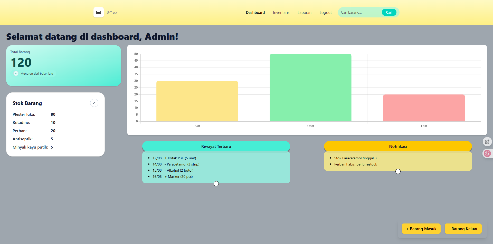

<p align="center">
  
</p>

# U-Track

**Student Medical Room Inventory Tool**

A web-based application built with Laravel, Python, and TailwindCSS for managing student medical room inventory.

## Features
- Record incoming and outgoing items
- Fast inventory search

## Installation
Clone the repository:
   ```bash
   git clone https://github.com/username/u-track.git
```
Navigate to the project directory:

```bash
cd u-track
```
Install dependencies using Composer:

```bash
composer install
```
Running the Application
Run the command below:

```bash
php artisan serve
```
Then access the application in your browser at http://localhost:8000.

Usage Example


License
This project was created for school purposes and does not have a public distribution license.
